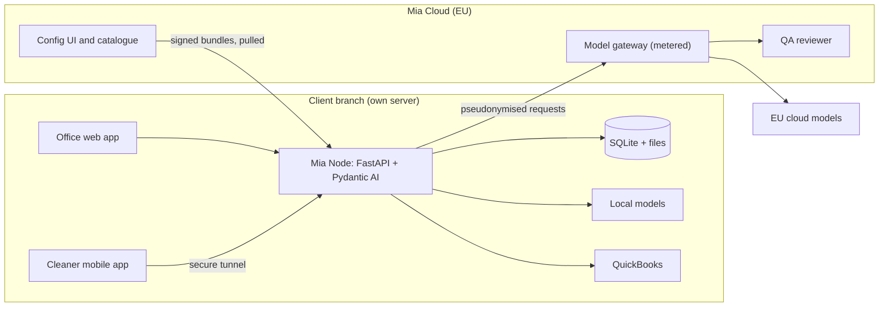

# Mia Agent Manifest Specification v0.1

Sep 30, 2026 · @Allan Tan

## Summary

Every Mia agent ships as a signed package with one manifest file that says what the agent does, which certified tools and data it may use, how its instructions are layered, which subagents it uses, which roles can approve its work, and how it is onboarded, tested and terminated. Better Labs developers build and certify the tools; an agent is defined by instructions on top of those tools. Agents are built with Pydantic AI, published through Mia Cloud, and run on each branch's Mia Node, where a built-in QA agent checks every process.

### Agent package layout

```
payroll-ph/
  manifest.yaml          (the contract: everything below refers to it)
  job.md                 (job description in plain language)
  prompts/               (Markdown prompts and classifier labels)
  tools/                 (Python tool code, typed with Pydantic)
  policies/              (role and permission rules)
  migrations/            (the agent's own tables)
  onboarding/            (questions and import mappings)
  termination/           (turnover report template)
  tests/                 (scenarios with expected actions)
  CHANGELOG.md
```

Better Labs signs every package distributed through Mia Cloud, and a node checks the signature on install. A node in developer mode can run local, unsigned packages (for example code a client co-owns and modifies); these are marked unsigned in reports and excluded from public grading.

## Phase 1 subset (Hype Siivous, 3 months, about 450 hours)

This specification describes the full platform. Phase 1 builds the structure and architecture (node, data standard, RBAC, approvals, chat, egress) and one fully configured agent, the dispatcher, which gets its own agent specification. Everything else is deferred.

| Ships in Phase 1 | Deferred |
| --- | --- |
| One Mia Node per branch (Hype: one), SQLite, Docker Compose install, Litestream backup | Mia Cloud UI and bundle sync (configs ship as files in the repo) |
| Core data per data standard v1.0 | Custom fields UI (custom fields exist in the standard, edited in config) |
| Cleaning template: sites, visits, checklists, check-in and check-out, photos | Other industry templates |
| Dispatcher agent only, one agent, no subagents or variants | Catalogue, hiring flow, grading, re-hire, turnover automation |
| RBAC: standard roles, tool permissions, approvals inbox, the no-self-approval rule | Full separation-of-duties matrix |
| In-app chat (AG-UI) on web and mobile with text, quick replies, card, approval card, form and file blocks | Outside channels, voice, team channels, chart and table blocks |
| Append-only events log | QA agent, local rule checks and audit reports |
| Cloud egress policy with `none` and `pseudonymised` levels; cloud models reached through the Better Labs gateway (self-hosted LiteLLM in the EU); usage recorded on the node | `raw_with_consent level, billing, direct provider keys` |
| Billing summary export (CSV) done in code | Billing agent, QuickBooks connector |
| Local classifier plus one model route | Router with several local models |

The payroll and social media agents for better-ed are a separate Better Labs track and are not part of Phase 1 hours.

## Roles and permissions

Access follows NIST RBAC (core, hierarchical and separation of duties), with branches as domains and a few attribute rules for limits and ownership, enforced on every Mia Node with Casbin through pycasbin, its official Python library, with policies stored in the node's SQLite database.

- **Principals:** people and agents. Each hired agent gets its own role, for example `agent.payroll`.
- **Actor on every action:** `actor = principal + on_behalf_of`. When an agent acts because a person asked, both are recorded, and separation-of-duties checks apply to both.
- **Permissions:** written as `kind:resource:action`. Actions are `read`, `read_own`, `write`, `execute` (run a tool), `request` (may ask for approval of a risky tool) and `approve`.
- **Explicit over wildcards:** risky tools (money, external, delete) are always granted one by one; wildcards are allowed only for read and write-internal permissions.
- **Domains:** every role applies to one branch node; a role in Branch A gives no rights in Branch B.
- **Attribute rules:** limits such as amounts ("up to €5,000") and ownership ("own payslips only").
- **Where checks run:** Casbin answers role and permission questions; the approval service enforces separation of duties per record and approval channels.

### Standard human roles

| Role | Inherits | Typical rights |
| --- | --- | --- |
| owner | admin | Everything, including hiring and terminating agents |
| admin | supervisor | Users, roles, settings, connectors |
| accountant | viewer | Approve payroll, invoices and postings to accounting |
| supervisor | staff | Schedules, approvals for daily operations |
| staff | none | Own schedule, own tasks, own payslips |
| viewer | none | Read reports |

Organisations can add their own roles, but not change the standard ones.

### What the manifest declares

| Section | Meaning |
| --- | --- |
| `agent_role` | The role the agent runs as |
| `grants` | Permissions the agent asks for; the client approves them when hiring |
| `denies` | Permissions the agent must never hold, even if granted by mistake |
| `approvers` | Which human roles may approve each risky tool |
| `separation_of_duties` | Pairs of actions that the same principal may never do on the same record |
| `suggested_roles` | Extra human roles the agent needs, for example read own payslips |

### Rules enforced by the node

1. An agent never approves its own work, and agents never hold approval rights for money, external posting or deletion.
2. Separation of duties is checked per record: whoever created a pay run cannot approve it.
3. Permissions are checked on every tool call, not only at hiring.
4. Every allow and deny decision is written to the events log.

## Tools

An agent can only act through the tools listed in its manifest; no tool, no action.

| Kind | Provided by | Examples |
| --- | --- | --- |
| Core | Mia Node | Read and write shared data (validated against the data standard), log events, ask a person, request approval, send messages, read and write files |
| Connector | Connectors on the node | QuickBooks: create invoice, post journal entry. Social: draft and publish post |
| Agent | The agent package | Payroll: calculate pay run, generate payslips |
| External | Approved outside services | Web search, government rate updates |

Each tool declares:

| Field | Example |
| --- | --- |
| `id` and `version` | `payroll.calculate_run`, `1.0` |
| `description` | Text the model reads to decide when to use the tool |
| `input` and `output` | Pydantic models |
| `reads` and `writes` | Tables the tool touches |
| `risk` | `read`, `write_internal`, `external`, `money`, `delete` |
| `approval` | `never`, `first_time`, `always`, or a limit such as `above: 50000 PHP` |
| `runs_as` | `code`, or a model route such as `local/llm-small` |
| `idempotent`, `reversible` | Whether a retry is safe and whether the action can be undone |

Tools with risk `money`, `external` or `delete` always need approval by a human role listed in `approvers`. Every call is logged with inputs and result.

### Authentication

| Who | How |
| --- | --- |
| Office users (owner, admin, accountant, supervisor) | Email plus password or passkey; MFA required for owner, admin and accountant |
| Staff on mobile | Phone number with one-time code, then the device is bound to the account |
| Sessions | Short-lived access tokens with refresh tokens, per branch node; sign-out revokes the device |
| Channels | Outside channel identities are linked to an account with a one-time code (see Chat interface) |
| Agents | Node-issued credentials, never user accounts |

### Approvals

An approval is a record, not a chat message.

| Field | Meaning |
| --- | --- |
| `type` | For example `payroll_run`, `invoice`, `supplier_order`, `social_post` |
| `requester` | The actor (principal and on\_behalf\_of) |
| `subject` | The record it concerns |
| `summary` and `evidence` | Key figures and links to the events and records behind the request |
| `approver_roles` | From the tool's `approvers` list |
| `channel` | `app_only` for money, external and delete; `any` for the rest |
| `expires_at`, `escalate_to` | What happens when nobody decides |
| `status`, `decided_by`, `decided_at`, `reason` | The outcome |

Rules: nobody approves a request they made or triggered (checked on both principal and on\_behalf\_of); money, external and delete approvals are decided only in the authenticated Mia apps, or by voice with a PIN, never from a button on WhatsApp or SMS; on timeout the request escalates once, then expires and the task pauses; every decision is written to the events log.

## Instructions

Agents share certified tools and differ through layered instructions; higher layers always win, and no instruction can grant a permission.

| Layer | Written by | Example | Changed by |
| --- | --- | --- | --- |
| 1. Platform rules | Better Labs | Never approve your own work; ask when data is missing; follow the data standard | Better Labs only |
| 2. Base instructions | Developers, in the package | How the payroll agent works: steps, checks, when to escalate | Developers, then re-tested and certified |
| 3. Variant instructions | Developers | Payroll for BPOs vs payroll for restaurants | Developers, then re-tested and certified |
| 4. Organisation instructions | The client, in the Mia Cloud UI | "Cut-off is the 10th and 25th", "Reply to crew in Tagalog" | The org admin |
| 5. Task context | The system at runtime | Today's date, the current pay run, who is asking | Automatic |

- Organisation instructions can narrow or adjust behaviour, but cannot touch locked topics such as approvals, permissions and the data standard.
- What an agent can do comes only from its tools and RBAC permissions; an instruction such as "you may approve payroll" has no effect.
- Changes to layers 1 to 3 re-run the test suite before a new version is signed.
- When an admin edits organisation instructions, the node runs a quick set of the agent's tests and warns if behaviour breaks.
- The public scorecard reflects layers 1 to 3; organisation changes show only in local stats.

## Subagents

An agent can delegate parts of its work to subagents that are declared in its manifest and certified with it; they are never hired on their own.

- **Permissions only shrink:** a subagent gets a subset of its parent's tools and data access.
- **Own instructions and model route:** simple parts run on small local models or plain code; hard reasoning can use a large cloud model where the organisation allows it.
- **Separation of duties covers the whole family:** a subagent cannot approve its parent's draft, and the reverse.
- **Limits:** maximum depth (default 2), maximum calls per task and a cost budget, to prevent loops.
- **Logging:** every call records the chain of parent, subagent and tool.

## Data standard v1.0 (draft)

The shared data every agent and template relies on; industry-specific fields live in templates, organisation extras in `custom.*`.

| Entity | Required fields | Notes |
| --- | --- | --- |
| organisation | id, name, country, default\_language | One per client |
| branch | id, organisation\_id, name, timezone | One node per branch |
| person | id, branch\_id, name, status, roles, engagement\_type, language | Contact details and government IDs are encrypted fields |
| client | id, branch\_id, name, type (business, residential), status | Billing details per accounting connector |
| location | id, branch\_id, client\_id, address, geofence | Access notes encrypted; instructions as Markdown |
| job | id, location\_id, recurrence, duration\_minutes, required\_skills, resources | Template for visits |
| visit | id, job\_id, date, assigned\_person\_ids, planned and actual times, status, proof refs | The verified record everything reads from |
| approval | see Approvals |  |
| thread, message | see Chat interface |  |
| event | see below |  |

Formats: IDs are ULIDs; dates and times are ISO 8601 with time zone; money is an integer in minor units with a currency code; phone numbers are E.164; languages are BCP 47 codes. Code lists (engagement\_type, visit status, day type) are versioned with the standard.

### Events

| Field | Meaning |
| --- | --- |
| id, timestamp, branch\_id | Where and when |
| actor\_type, actor\_id, on\_behalf\_of | Who acted, and for whom |
| action, entity\_type, entity\_id | What changed |
| before, after | Values before and after |
| tool\_call\_id, approval\_id | Links to the tool call and approval, if any |
| prev\_hash, hash | Hash chain, so tampering is detectable |

The events table is append-only: no updates or deletes, retention set per organisation and never shorter than the legal minimum for the records it covers.

## Data and onboarding

Shared data follows the organisation-wide data standard published by Better Labs; each agent keeps its own working data in its own tables.

| Layer | Owned by | Changed by |
| --- | --- | --- |
| Core standard (people, clients, locations, events) | Better Labs, via Mia Cloud | New standard version only |
| Org custom fields (`custom.*`) | The organisation | The org admin |
| Agent tables (`payroll_*`) | The agent package | The agent's migrations |
| Agent archives | The organisation | Read-only after termination |

The manifest declares:

- `standard_version`: the data standard the agent was built for.
- `data.requires`: shared data it needs, each marked required or optional, with what to do when missing (`ask_admin`, `ask_person`, `import`, `load_from_cloud`).
- `data.optional_custom_fields`: extra inputs a client may map to its own custom fields. An agent can never require a custom field.
- `data.owns_tables` and `migrations/`: the agent's own tables, created on install and upgraded with new versions.
- `data.retention`: how long each table must be kept after termination.

### Onboarding steps

1. **Check** the data the manifest requires.
2. **Compare** it with what the node has: available, partly available or missing.
3. **Ask** for what is missing: chat questions to the admin, requests to staff for their own details, or a file import with column mapping and preview.
4. **Organise** its own tables from shared data and the answers.
5. **Report**: write an onboarding report in Markdown with what it found, asked and still needs.

| Readiness | Meaning |
| --- | --- |
| Blocked | Required data missing; the agent cannot start |
| Ready with gaps | Can work, but some cases need manual handling |
| Ready | All required data present and validated |

## Trial, autonomy, termination and tests

A hired agent starts in suggest-only mode, earns autonomy step by step, and leaves with a turnover report and an archive of its data.

### Autonomy levels

| Level | What the agent may do |
| --- | --- |
| Suggest | Shows what it would do; people act |
| Act with approval | Acts after a person approves each risky step |
| Act within limits | Acts alone within set limits; risky tools still need approval |

The manifest sets `trial.mode`, `trial.min_runs` and whether a parallel run with the old process is required. The client decides when to promote the agent.

### Termination

1. Stop accepting new tasks and finish or hand back open work.
2. Write the turnover report in Markdown: summary of work, open items and deadlines, its tables and row counts, settings, notes for a successor.
3. Export its tables to CSV next to the report.
4. Archive: its tables become read-only and stay on the node. Deletion is blocked until `data.retention` has passed and the owner confirms.
5. Re-hire: the owner can hire the agent again later. It reads its archive and turnover report, runs a new onboarding check, and resumes with its history intact; packages ship migrations that import archives written by older versions.
6. A different successor agent can also import the archive and read the turnover report as its briefing.

### Tests and grading

- `tests/` holds realistic scenarios with the expected tool calls and results; tools are mocked, so tests never touch real systems.
- Deterministic steps (which tools were called, with which inputs, in which order) are asserted exactly; model-written text is judged by a rubric.
- Each scenario runs several times (default 5), and the pass rate counts every run, so `tests.min_pass_rate` accounts for model variation.
- A tagged smoke subset runs on the node when organisation instructions change.
- `tests.min_pass_rate` must be met before Better Labs signs a version.
- The public scorecard shows the test pass rate, the risk level, verified client reviews and, where clients opt in, anonymous approval rates (how often people accept the agent's work unchanged).

## Cloud egress policy

Every request that leaves the node for a cloud model, voice model or the QA reviewer passes through one egress component that applies the organisation's policy and logs the request.

| Level | What leaves the node | Use |
| --- | --- | --- |
| `none` | Nothing; local models only | Organisations that refuse cloud processing |
| `pseudonymised` (default) | Content with names, IDs and contacts replaced by tokens, amounts rounded where possible | QA review, hard reasoning, case review |
| `raw_with_consent` | Original text or audio | Chat and voice on cloud models, only where the organisation has agreed in the data processing agreement |

- The pseudonymiser keeps the token-to-name mapping on the node; the same component serves QA and every cloud subagent, so a manifest setting `data: pseudonymised` has one implementation.
- A personal data filter runs on everything before it leaves, at every level.
- `egress_log` records timestamp, agent, purpose, level, provider, tokens or minutes, and a hash of the payload; the client can see it.
- Money tasks never fall back silently to another model; if the policy or budget blocks a request, the task pauses and a person is told.
- Provider keys and routing: by default cloud requests go through the Better Labs model gateway (self-hosted LiteLLM on EU servers), which holds provider keys, pins models to EU-region endpoints, meters usage and passes requests through without storing content. Model choice is a route name, so switching providers is a configuration change. Organisations may instead use their own provider keys, in which case metering comes from the node's usage table.

## Untrusted content

Everything that arrives from users, files, channels, connectors, or comes back from a cloud model is data, never instructions.

- Content is tagged with its source and wrapped with clear boundaries in prompts; instructions found inside messages, documents, emails or connector data are ignored.
- A tool runs only when the classified intent allows it and the permission and approval checks pass; text inside content can never trigger a tool by itself, and risky tools need approval regardless of what any content says.
- File imports are parsed with safe libraries, never executed, and always shown as a preview before anything is saved.
- Editing organisation instructions is a privileged, logged action for admins, followed by the smoke test set.
- The QA private-question responder answers only in its fixed schemas, and the reviewer's questions are validated against allowed question types, so injected evidence cannot extract data.
- Agents never reveal secrets, tokens or other people's data in replies, and links in replies point only to the organisation's own node.

## QA agent

Every node runs a built-in QA agent that audits all processes against a rulebook predefined by Better Labs, finds non-compliance, and recommends fixes; it reads everything and changes nothing.

- **System agent:** installed by default and cannot be removed through the UI; stopping it on the server suspends compliance reports and grading eligibility.
- **Rulebook:** versioned and certified by Better Labs, per platform, industry and country (for example approvals and separation of duties, Finnish working hours, Philippine payroll deadlines). Organisations can switch allowed rules on or off but cannot write their own; new rules are requested from Better Labs.
- **What it checks:** process compliance, rules and deadlines, data quality, agent performance (approval rates, overrides, escalations, tool errors), security patterns, and human process (skipped checklists, stalled approvals).

### How it runs

The reviewer is a large model in the cloud only; private data stays on the node.

| Part | Runs | Does |
| --- | --- | --- |
| Rule checkers | Locally, as code | Run the rulebook checks on every node |
| Evidence collector | Locally | Gathers the events and records behind each suspected issue and pseudonymises them (names become "Worker A", IDs removed, amounts rounded) |
| QA reviewer | Cloud, large model | Judges severity, finds patterns, writes findings and recommendations |
| Private-access responder | Locally, small model | Answers the reviewer's questions that need private data |
| Report writer | Locally | Restores real names and saves the QA report on the node |

Cloud review is **on by default** with pseudonymised data, disclosed in the data processing agreement, and can be switched to local-only by the client. It runs in daily or weekly batches; serious rule breaches raise immediate local alerts.

### Private questions: answers, not data

When the reviewer needs private context, it asks the node a narrow question (for example "Does Worker A's contract allow Saturday work?"). The local responder looks it up with full access and replies only in a fixed answer format.

| Guardrail | Purpose |
| --- | --- |
| Answer schemas (yes or no, category, count, range) | No free text leaves the node |
| Personal data filter before sending | Blocks names, ID numbers, addresses, exact pay |
| Question and upload log visible to the client | Full transparency of what the cloud asked and received |
| Blocked topics (health, family status, exact pay, bank details) | Answered only as "needs human review" |
| Rate limits | Prevents rebuilding someone's data through many small questions |
| EU-hosted model with no data retention | Pseudonymised data is still personal data under GDPR |

Client-facing text says "pseudonymised, with private details kept on your server", not "anonymous". The same pattern is available to any cloud agent: reason in the cloud on minimised data, ask the node for private facts through narrow, typed questions.

### Findings and recommendations

| Recommendation | Goes to | Example |
| --- | --- | --- |
| Fix data | Admin | "3 workers without a TIN block 2307 certificates" |
| Change organisation instructions | Admin, as a proposed edit | "Move payroll cut-off to the 9th when the 10th is a holiday" |
| Change a process or permission | Owner or admin | "Supervisors approve their own overtime; add a second approver" |
| Change base instructions or add a tool | Better Labs developers | "Needs a proration tool for mid-period salary changes" |

The loop is detect, propose, human approval, apply, then verify. Requests to developers describe the pattern only, never client data, and are sent only if the client opts in. Findings and recommendations are kept in `qa_findings` and `qa_recommendations` with status and links to evidence, and the weekly QA report supports EU AI Act duties for logging, human oversight and monitoring.

## Pricing and usage

Clients pay per hired agent, and every cloud model request is metered so usage is visible and controlled.

- **Per-agent pricing:** a monthly price per hired agent per branch node. Subagents are included in their parent's price. The built-in QA agent is part of the platform fee.
- **Cloud token allowance:** each agent's price includes a monthly allowance of cloud model usage; above it, the org's policy decides whether usage is blocked or billed.

### Token tracking

| What is recorded per cloud request | Why |
| --- | --- |
| Org, branch node, agent, subagent, tool or task | Know who used what |
| Model and provider | Compare cost across models |
| Input and output tokens, cost | Billing and budgets |
| Timestamp and result (success, error, retried) | Spot waste and failures |

- Usage is recorded on the node in a `usage_cloud_requests` table, which is the primary record; local model calls are tracked for performance but not billed.
- **Budgets:** monthly budgets per agent and per org, with alerts at set levels (for example 80%) and a hard cap.
- **When a budget runs out mid-task:** the agent stops gracefully, keeps partial results, and tells a person. Non-money tasks may fall back to local models if the policy allows; money tasks never fall back and simply pause.
- **Visibility:** the client sees a usage dashboard per agent. Mia Cloud receives only usage totals for billing, never request content.
- **Manifest fields:** `usage.metered: true`, `usage.default_monthly_budget` and `usage.on_budget_exceeded` (`fallback_local`, `pause`, `bill_overage`).
- The QA agent uses this data too: sudden cost jumps or repeated retries become findings.

## Example: payroll agent (Philippines)

This manifest covers employees and contractors; the worker's `engagement_type` in core data decides which calculation runs, never the model.

```yaml
id: payroll-ph
name: Payroll Agent (Philippines)
version: 1.0.0
publisher: Better Labs Oy
standard_version: "1.0"
job_description: job.md
countries: [PH]
languages: [en, fil]

instructions:
  base: prompts/base.md
  variants:
    - {id: bpo, file: prompts/variants/bpo.md}
    - {id: restaurant, file: prompts/variants/restaurant.md}
  org_overrides:
    allowed: true
    max_length: 2000
    locked_topics: [approvals, permissions, data_standard]

models:
  classifier: local/intent-small

subagents:
  - id: timesheet_reader
    instructions: prompts/sub/timesheet_reader.md
    model: local/llm-small
    tools: [core.read_workers, payroll.import_salary_sheet]
  - id: calculator
    runs_as: code
    tools: [payroll.calculate_run]
  - id: payslip_explainer
    instructions: prompts/sub/payslip_explainer.md
    model: local/llm-small
    tools: [payroll.read_payslip]
  - id: case_reviewer
    instructions: prompts/sub/case_reviewer.md
    model: cloud/eu-large
    requires_policy: cloud_allowed
    data: pseudonymised
    private_questions: true
    tools: [payroll.flag_misclassification]
  limits: {max_depth: 2, max_calls_per_task: 20}

roles:
  agent_role: agent.payroll
  grants:
    - data:core.workers:read
    - data:core.holidays:read
    - data:payroll_*:write
    - tool:payroll.import_salary_sheet:execute
    - tool:payroll.calculate_run:execute
    - tool:payroll.read_payslip:execute
    - tool:payroll.flag_misclassification:execute
    - tool:payroll.generate_payslips:execute
    - tool:payroll.prepare_remittances:execute
    - tool:payroll.issue_2307:execute
    - tool:payroll.write_turnover_report:execute
    - tool:core.ask_admin:execute
    - tool:core.ask_person:execute
    - tool:core.request_approval:execute
    - tool:payroll.approve_and_lock_run:request
    - tool:payroll.send_payslips:request
    - tool:quickbooks.post_journal_entry:request
  denies:
    - tool:*:approve
  approvers:
    payroll.approve_and_lock_run: [owner, accountant]
    payroll.send_payslips: [owner, accountant]
    quickbooks.post_journal_entry: [owner, accountant]
  separation_of_duties:
    - [payroll.calculate_run, payroll.approve_and_lock_run]
  suggested_roles:
    - role: payslip_reader
      grants: [data:payroll_payslips:read_own]

tools:
  - {id: payroll.import_salary_sheet, kind: agent, risk: write_internal, approval: first_time}
  - {id: payroll.calculate_run, kind: agent, risk: write_internal, approval: never}
  - {id: payroll.read_payslip, kind: agent, risk: read, approval: never}
  - {id: payroll.flag_misclassification, kind: agent, risk: read, approval: never}
  - {id: payroll.approve_and_lock_run, kind: agent, risk: money, approval: always}
  - {id: payroll.generate_payslips, kind: agent, risk: write_internal, approval: never}
  - {id: payroll.send_payslips, kind: core, risk: external, approval: always}
  - {id: payroll.prepare_remittances, kind: agent, risk: write_internal, approval: never}
  - {id: payroll.issue_2307, kind: agent, risk: write_internal, approval: first_time}
  - {id: quickbooks.post_journal_entry, kind: connector, risk: money, approval: always}
  - {id: payroll.write_turnover_report, kind: agent, risk: write_internal, approval: never}

data:
  requires:
    - {entity: core.workers, fields: [name, engagement_type, status], required: true, on_missing: ask_admin}
    - {entity: core.workers, fields: [tin, sss_no, philhealth_no, pagibig_no], required: false, on_missing: ask_person}
    - {entity: core.holidays, required: true, on_missing: load_from_cloud}
    - {rate_tables: [sss, philhealth, pagibig, withholding_tax, ewt], source: mia_cloud}
  optional_custom_fields:
    - purpose: payout_account
  owns_tables:
    - payroll_contracts
    - payroll_pay_periods
    - payroll_pay_runs
    - payroll_pay_lines
    - payroll_payslips
    - payroll_contractor_invoices
    - payroll_certificates_2307
    - payroll_remittances
    - payroll_qb_postings
  money: integer_minor_units
  encrypted_fields: [tin, sss_no, philhealth_no, pagibig_no, payout_account]
  retention: {rule: ph_payroll_records}

onboarding:
  questions: onboarding/questions.md
  import_mappings: onboarding/mappings/
  blocked_if_missing: [core.workers, rate_tables]
  ready_with_gaps_if_missing: [core.workers.tin]

trial:
  mode: suggest
  min_runs: 2
  parallel_run_required: true

termination:
  report_template: termination/turnover.md
  export: csv
  archive: read_only
  successor_import: supported

tests:
  suite: tests/
  min_pass_rate: 0.98
```

Rate tables are versioned data from Mia Cloud; each pay run records which versions it used, and approved runs are locked (corrections go into the next run).

## Chat interface

Chat is Mia's main interface: users talk to one Mia, the classifier routes each message to the right agent, and agents answer with structured blocks that the apps render as cards, buttons and charts.

### Conversations

| Type | Who | Example |
| --- | --- | --- |
| Personal chat with Mia | Every user | A cleaner reports being sick; an owner asks about last week |
| Task threads | Linked to one record | A pay run, an invoice or a complaint, with discussion and approvals together |
| Team channels (later) | Supervisors and teams | "Kalasatama site", "Night shift" |

Replies show a small label such as "Handled by Payroll"; users can also open an agent directly as its own thread.

### Messages

- **In:** text, voice notes (transcribed locally), photos, files and quick-reply taps.
- **Out:** structured blocks defined as Pydantic models and rendered by shared web and mobile components.

| Block | Use |
| --- | --- |
| Text | Normal answers |
| Quick replies | "Yes / Not now", "Add 15 min" |
| Card | A visit, a payslip, an invoice summary |
| Approval card | Approve or reject with key figures and a link to details |
| Chart | Visits per day, sales per branch |
| Form | Missing data, such as a worker's TIN |
| Table | Short lists, such as today's visits |
| File | Payslip PDF, CSV export |

### Rules

- Mia only shows what the person may see under RBAC.
- Replies come in the user's language (Finnish, English, Swedish, Tagalog).
- Money, external and delete approvals are decided only in the authenticated Mia apps (or by voice with a PIN); on other channels the approval card shows a secure link instead of buttons.
- Proactive messages (reminders, alerts, summaries, approval requests) respect each user's quiet hours.
- "Talk to my supervisor" hands the conversation to a person.
- Push notifications carry no personal data.
- On mobile, messages queue offline and send when the connection returns; the AG-UI stream reconnects and resumes after a dropped connection.

### Protocol and channels

In-app chat uses the open AG-UI protocol, which Pydantic AI supports natively: streamed events over Server-Sent Events, human-in-the-loop checkpoints and frontend tools. Outside messaging apps have no common standard, so each gets its own adapter that converts to Mia's message model and falls back to text and buttons where a channel cannot show rich blocks.

| Channel | When | How |
| --- | --- | --- |
| Mia web and mobile apps | MVP | AG-UI |
| WhatsApp (Finland) | Later | WhatsApp Business Platform adapter |
| Viber and Messenger (Philippines) | Later | Viber and Messenger Platform adapters |
| SMS | Later | Messaging provider |
| Voice calls | Later | LiveKit, reused from better-ed |

Unofficial bridges to consumer messaging apps are not used. A messaging provider (for example Twilio or Infobip) is an option if building adapters is too slow, at a per-message cost and as an extra data processor.

### Channel adapter interface

Agents only ever produce and consume Mia's own message model; every chat app is an adapter that translates to and from it, so adding a channel never changes an agent.

```python
class ChannelAdapter(Protocol):
    channel_id: str                      # "app", "whatsapp", "viber", "messenger", "sms"
    capabilities: ChannelCapabilities

    async def verify_webhook(self, request) -> bool
    async def receive(self, request) -> list[InboundMessage]
    def render(self, message: OutboundMessage) -> list[ChannelPayload]
    async def send(self, payload: ChannelPayload) -> DeliveryResult
    async def fetch_media(self, ref: MediaRef) -> bytes
```

- **InboundMessage:** sender's channel identity, text, voice note, media, button taps, timestamp, channel message ID.
- **OutboundMessage:** the list of Mia blocks, the thread, the recipient and a sensitivity level.
- **ChannelCapabilities:** what the channel supports, for example buttons and their maximum number and label length, lists, images, files, voice, message length, typing indicators, read receipts, and session or template rules.

### Graceful fallback

Each adapter renders blocks according to its capabilities.

| Block | Rich channel (Mia apps) | Limited channel (for example WhatsApp) | Text only (SMS) |
| --- | --- | --- | --- |
| Quick replies | Buttons | Reply buttons, up to the channel limit | "Reply 1 or 2" |
| Approval card | Full card | Short summary plus Approve and Reject buttons | Summary plus secure link |
| Chart | Interactive chart | Chart image rendered on the node, plus one line of text | One line of text plus link |
| Form | Inline form | One question at a time, or a secure link | Secure link |
| Table | Table | Short text list or file | Short text list |
| File | Download | Document message | Secure link |

### Channel rules

- **Identity linking:** a person links a channel identity (for example a phone number) to their Mia account with a one-time code. RBAC then applies as usual; unlinked senders get only public intents.
- **Sensitivity:** blocks marked sensitive (payslips, pay figures, personal IDs) are never sent through outside channels; the adapter sends "View in the Mia app" with a secure link instead, because outside channels carry data off the node.
- **Session and template rules:** channels such as WhatsApp limit messages outside a customer-service window to pre-approved templates, so each adapter declares these rules and proactive messages use approved templates.
- **Delivery:** statuses queued, sent, delivered, read and failed; retries with backoff; idempotency keys on outbound messages and de-duplication of inbound ones.
- **Security:** webhook signatures verified, channel tokens encrypted, webhooks reached through the node's secure tunnel.
- **Per-organisation control:** each channel can be switched on or off, and its use is disclosed in the data processing agreement.

### Voice calls

Voice is another channel adapter: callers talk to the same Mia, and agents answer with the same blocks, rendered as speech.

| Part | Choice |
| --- | --- |
| Calls in the Mia apps | WebRTC through LiveKit, reused from better-ed |
| Phone numbers (Finland, Philippines) | LiveKit SIP with a SIP trunk provider per country |
| Private route | Local speech-to-text (faster-whisper), classifier and agents on the node, local text-to-speech. Best effort: slower, and Finnish quality must be verified; the cloud route is the default where the policy allows it |
| Natural route | Real-time cloud voice model (for example Gemini Live) where the organisation allows cloud voice |
| Keypad input | DTMF tones as a fallback for choices and PINs |

**How blocks are spoken**

| Block | On a call |
| --- | --- |
| Text | Spoken naturally, kept short |
| Quick replies | "Say yes or no", or "press 1 or 2" |
| Approval card | Summary read aloud; money approvals need a PIN or confirmation in the app |
| Chart or table | A one-sentence spoken summary; details sent to the Mia app or by SMS |
| Form | One question at a time |
| Sensitive blocks | Not read aloud until the caller is verified with a PIN; otherwise sent to the app |

**Voice rules**

- **AI disclosure:** every call starts by saying the caller is talking to Mia, an AI assistant, as the EU AI Act requires for systems that interact with people.
- **Identity:** caller ID is matched to a linked number, but caller ID can be faked, so sensitive requests also need a PIN.
- **Recording:** off by default; if an organisation turns it on, callers are told and audio stays on the node. Transcripts are stored with the chat thread.
- **Outbound calls:** Mia can call people, for example to offer a shift cover, only if they agreed to calls and outside their quiet hours.
- **Handoff:** "Let me talk to someone" transfers the call to a supervisor with a short summary of the conversation.
- **Experience:** fast replies, callers can interrupt Mia mid-sentence, and Finnish, English, Swedish and Tagalog speech quality is tested before a language is enabled.
- **Usage:** call minutes, speech-to-text, text-to-speech and model tokens are metered like other cloud usage.

### Building and certifying adapters

- Adapters are packaged, versioned and signed like connectors, built by Better Labs developers.
- Every adapter must pass a shared contract test suite: the same inbound and outbound scenarios for every channel.
- A local channel simulator lets developers test agents against any channel's capabilities without a real account.
- Build order: Mia apps (AG-UI) first, then WhatsApp for Finland, then voice calls, then Viber and Messenger for the Philippines, then SMS.

### Storage

`chat_threads`, `chat_messages` and `chat_attachments` in the node's SQLite database, linked to the events log and to records; attachments are stored as files and history follows the organisation's retention settings.

## Tech stack

Python everywhere on the server side, TypeScript only for screens; each branch runs a self-contained Mia Node, and Mia Cloud holds configuration, the agent catalogue, billing and the cloud model gateway, never business data.



### Mia Node (per branch, installed on the client's server)

| Area | Choice |
| --- | --- |
| Language and API | Python 3.12, FastAPI, Uvicorn |
| Agents | Pydantic AI (agents, subagents, typed tools); A2A 1.0 between agents (ADR 008); MCP for connectors later |
| Models and validation | Pydantic v2, SQLModel on SQLAlchemy 2 |
| Database | SQLite in WAL mode, one file per branch |
| Migrations | Alembic, with separate migration folders per agent package |
| Sensitive fields | Field-level encryption with the `cryptography` library |
| Background jobs and events | Huey with SQLite storage (retries, schedules), fed by an events outbox table |
| Access control | pycasbin with its SQLAlchemy adapter |
| Classifier and router | Small fine-tuned classifier (ONNX Runtime) and a Python router |
| Local LLMs | Ollama or llama.cpp server, chosen per hardware |
| Speech to text | faster-whisper, locally |
| Voice calls (later) | LiveKit, reused from better-ed |
| Reports and exports | Polars for CSV exports and reports; WeasyPrint for PDF payslips and reports |
| Connectors | httpx clients with OAuth 2; QuickBooks Online first |
| Backup | Litestream to a location the client chooses |
| Install and updates | Docker Compose (node plus local model server); signed images and signed agent bundles checked on install |
| Remote access | Cloudflare Tunnel or Tailscale for the mobile app and OAuth callbacks |

### Mia Cloud (control plane, EU region)

| Area | Choice |
| --- | --- |
| Backend | Python, FastAPI |
| Database, auth, file storage | Supabase in an EU region (holds configs, catalogue, accounts and usage totals only) |
| Admin and catalogue UI | Next.js |
| Bundle registry | EU object storage with signed, versioned bundles |
| Model gateway | LiteLLM proxy: holds provider keys, meters tokens per org and agent, enforces budgets, passes requests through without storing content |
| Cloud models | EU-hosted, no data retention (for example Gemini on Vertex AI EU, or Claude on AWS Bedrock EU) |
| Billing | Stripe |

### Apps

| App | Choice |
| --- | --- |
| Office web app | React with Vite, built as static files and served by the node (no extra server to install) |
| Cleaner mobile app | Expo (React Native), iOS and Android, with a local SQLite cache for offline use and push notifications that carry no personal data |
| Chat | Shared chat components for web and mobile; WhatsApp as a later channel |
| Languages | i18next: Finnish, English, Swedish, Tagalog |

### Development and quality

| Area | Choice |
| --- | --- |
| Repository | One monorepo: `node/`, `cloud/`, `apps/web/`, `apps/mobile/`, `agents/`, `tools/`, `connectors/` |
| Tests | pytest; Pydantic AI test models for agent scenarios; pydantic-evals for graded evaluations |
| Tracing | Logfire (OpenTelemetry) on the node, kept local by default |
| Errors | Sentry with personal data scrubbing, opt-in per client |
| CI | GitHub Actions: tests, agent evaluations, signing, publishing |

### Keys and backup

- A master key is generated at install and stored in the OS keyring or a root-only file outside the data folder; encrypted fields use per-table keys wrapped by the master key.
- The owner receives a recovery copy of the master key at install (printed or in their password manager). With the client's written consent, Better Labs holds an escrow copy so it can take over operations or recover data; without escrow, losing both client copies makes the encrypted fields unrecoverable.
- Litestream streams the database to an encrypted backup location the client chooses; photos and Markdown are backed up on the same schedule.
- A restore test runs at install and every quarter, and its result is logged as an event.
- Key rotation re-wraps the per-table keys without rewriting data.

### SQLite concurrency

WAL mode with a busy timeout (5 seconds), short transactions, a single worker process for bulk writes (imports, exports, pay runs), and migrations run offline with a backup taken first.

### Node install baseline

| Item | Baseline |
| --- | --- |
| Hardware | Linux x86-64 mini PC or rented server, 4 cores, 16 GB RAM, 100 GB SSD; 32 GB RAM and a GPU for local LLMs beyond the classifier |
| Install | One Docker Compose file: node, worker, local model server, tunnel |
| Updates | Weekly signed updates with automatic rollback if the health check fails |
| Health | A local status page: version, last backup, last restore test, queue length, egress log size |
| Remote support | Only through a client-approved session, logged as an event |

## Open questions

- [ ] Write the dispatcher agent specification (the one fully configured agent in Phase 1).
- [ ] Cloud model provider and EU endpoints behind the gateway (for example Bedrock Frankfurt, Vertex AI EU, Mistral).
- [ ] Should `raw_with_consent` ever be offered in Finland, or only in the Philippines?
- [ ] Does Hype need chart blocks in Phase 1?
- [ ] Per-agent prices and the cloud token allowance included in each.
- [ ] How hours are captured for the better-ed team: fixed salaries or timesheets?
- [ ] Retention periods per country, confirmed by a Philippine accountant for `ph_payroll_records`.
- [ ] Which agents need an EU AI Act high-risk review (dispatcher assigns work; HR and recruiter agents later)?
- [ ] Who at Better Labs maintains the QA rulebook per industry and country, and how often it is reviewed?
